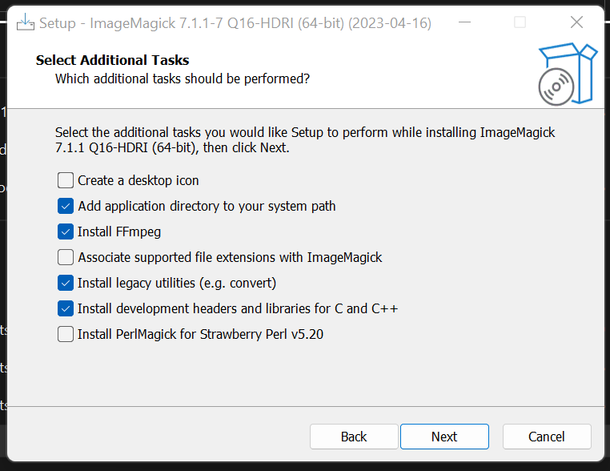

# Convex-Hull-DSA-Final-Project
**Ryan Brooks, Ryan Shilling, Sam Gryska, Brandt Ogden**

## Summary
A convex hull is a polygon that surrounds a set of points. It is convex because it will never have
an internal angle of 180 degrees or more. Our program can read in points through a text file of 0's and 1's, where a 1
represents a point. Our program then computes the convex hull using Graham's Scan Algorithm.
Graham's Scan Algoirhtm is broken up into 3 main steps.

1. Find the bottom leftmost point in the grid
2. Sort the remaining points based on the angle they make with the bottom leftmost point in the counterclockwise direction
3. Start from the bottom leftmost point compare it to the first two points in the sorted array of remaining points. If they make a right turn,
then the middle point is not part of the convex hull. It then moves on to the next point and checks that same condition. This process finishes
until there are no more sorted points left.

Our program implements this algorithm and provides a visualization of this algorithm finding the convex hull in the form of a GIF.

## Compilation Instructions 
The output will be a series of images which make up the graph through each step, which will then be complied into a GIF. The old images will be deleted after every run of the program.
Since we're using the Dot Language provided by Graphviz, you will need to install Graphviz on your computer to run the program. 
 
1. Install Graphviz on your computer https://graphviz.org/download/. Make sure when installing to check the box "Add Graphviz to the system PATH", as seen in the picture below.
   
2. Install Image Magick as well https://imagemagick.org/script/download.php. Like with Graphviz, make sure to check all the boxes that are listed in this picture below.   
   
3. Restart your computer so all the changes to your environment variables work properly.
4. If you're compiling on the command line then use this command below. If you're using CLion, please proceed with steps 5 and 6.
```
 g++ -o dsa main.cpp grid.cpp point.cpp -I "/Program Files/Graphviz/include" -L "/Program Files/Graphviz/lib" -lgvc -lcgraph
```

5. Make sure this text is included in your CMakeLists.txt in order to properly include your installation directory and to reference which libraries we'll be using.

```
cmake_minimum_required(VERSION 3.24)
project(Convex_Hull_DSA_Final_Project)

set(CMAKE_CXX_STANDARD 11)

set(GRAPHVIZ_INCLUDE_DIRS "C:/Program Files/Graphviz/include")
set(GRAPHVIZ_LIBRARY_DIRS "C:/Program Files/Graphviz/lib")
include_directories(${GRAPHVIZ_INCLUDE_DIRS})
link_directories(${GRAPHVIZ_LIBRARY_DIRS})

add_executable(Convex_Hull_DSA_Final_Project main.cpp grid.cpp point.cpp)
target_link_libraries(Convex_Hull_DSA_Final_Project gvc cgraph)
```
Note that in the "set(GRAPHVIZ_INCLUDE_DIRS..." lines you will need to change the installation directory to the one you picked when installing Graphviz. The CMakeLists file provided should have the default location.  
6. Reload the CMake project

### Input Text Files
There are already 15 example test files that have already been created in the directory ``/cmake-build-debug/TestFiles/``. They have a different
number of rows and columns are are a 2 dimensional grid of 0's and 1's that represent the points from which we create a convex hull.  
``Make sure that if you create your own input test files that they are in the directory mentioned above or the program will not be able to find it.``

## Command Line Arguments 
Command line arguments should be in the form ``<input_file> <num_rows> <num_columns>``. Like previously mentioned, there are already test files that you can use ranging from test_1_5_5.txt to test_15_3_4.txt that you can use. Make sure that you use the appropraite number of rows and columns based on the text file that you are using.
All of the text files that have already been created have the number of rows and columns as the second and third numbers in their name. So test_15_3_4.txt has
3 rows and 4 columns so you should use the following command line arguments, ``test_15_3_4.txt 3 4``.

## Runtime Instructions
Run the program with the command line arguments as specified above and then wait a few moments while the gif is created. If you are using a input file with the 
number of rows being 6 or greater, it can take more than a minute for the gif to be created.

## Sample Runs

### test_1_5_5.txt
Input:
```
0 1 0 0 0
1 0 1 1 0
0 1 1 0 1
1 0 0 0 1
0 1 0 0 0
```

GIF created:


### test_7_4_3.txt
Input:  
```
0 1 1
0 1 0
0 0 1
1 1 0
```
GIF created:  


### test_12_2_2.txt
Input:  
```
0 0
0 1
```
Output:  


### test_13_6_6.txt
Input:  
```
1 1 1 0 0 1
1 0 1 1 0 1
0 0 0 1 1 0
1 0 1 1 1 0
0 0 0 1 1 0
0 0 1 0 0 1
```
GIF created:  


